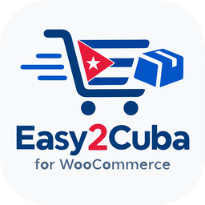
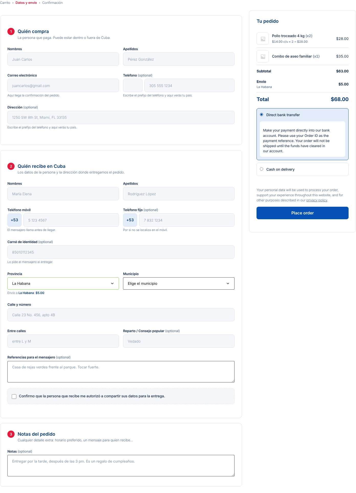
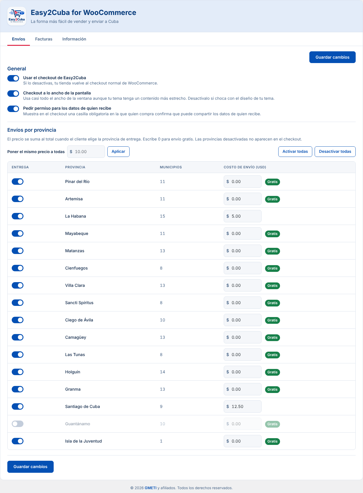
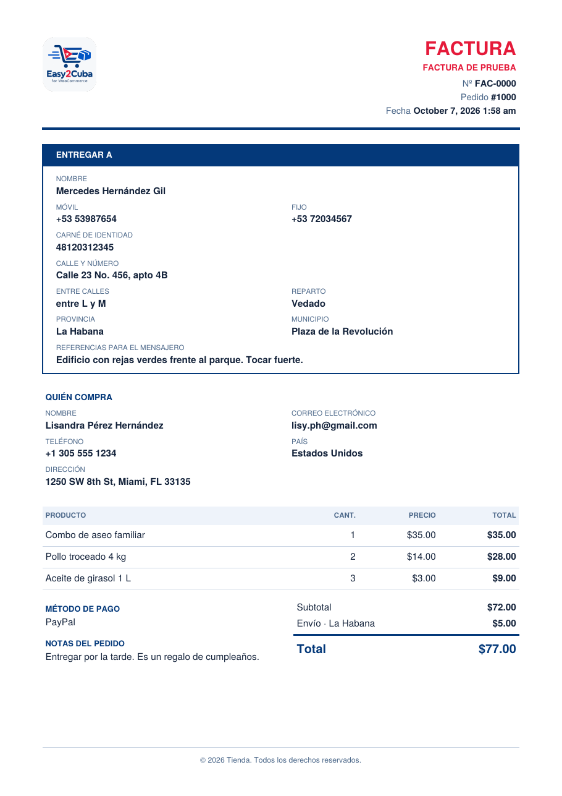

  

<h1 align="center">Easy2Cuba for WooCommerce</h1>

  <strong>La forma más fácil de vender y enviar a Cuba.</strong> 
  Un checkout para WooCommerce pensado para comprar desde cualquier país y entregar en Cuba.

  <a href="../../releases/latest"><strong>⬇ Descargar la última versión</strong></a>
  &nbsp;·&nbsp; <a href="https://wpdesigndev.github.io/easy2cuba-for-woocommerce/demo/">▶ Probar la demo</a>
  &nbsp;·&nbsp; <a href="https://wpdesigndev.github.io/easy2cuba-for-woocommerce/#instalar">🎬 Vídeo tutorial</a>
  &nbsp;·&nbsp; <a href="#english">English</a>
  &nbsp;·&nbsp; Desarrollado por <a href="https://gmeti.com">GMETI</a>

---

## Qué hace

- **Quién compra y quién recibe, por separado.** Quien paga puede estar en cualquier país; su país se elige en la lista o se pone solo con el prefijo del teléfono.
- **Toda Cuba.** Las 15 provincias, el municipio especial Isla de la Juventud y los 168 municipios, con móvil y fijo cubanos (+53), carné de identidad, entre calles, reparto y referencias para el mensajero.
- **Envío por provincia.** Pones el precio de cada provincia, activas solo donde entregas y el costo se suma solo al total.
- **Resumen claro del pedido.** Foto del producto, cantidad y precio por unidad (`$14.00 c/u × 2 = $28.00`).
- **PDF de entrega automático.** Al confirmarse el pago se envía por correo un documento informativo (FAC‑0001, FAC‑0002…) con todos los datos de la entrega, listo para reenviar al mensajero. Con tu logo, registro de documentos y SMTP opcional.
- **Compatible** con las pasarelas de pago de WooCommerce, Elementor, plugins de multimoneda (WPML/WCML, CURCY) y pedidos HPOS.
- **Privacidad:** se integra con las herramientas de exportar y borrar datos personales, propone texto para la política de privacidad y puede borrar documentos antiguos.
- **Español e inglés**, según el idioma de tu WordPress.

| Envíos por provincia | Documento PDF |
|---|---|
|  |  |

## Instalación

1. Ten **WooCommerce** instalado y activo. Es obligatorio.
2. Descarga **`easy2cuba-for-woocommerce.zip`** desde [la última versión](../../releases/latest) (el archivo adjunto, no "Source code").
3. En WordPress: **Plugins → Añadir nuevo plugin → Subir plugin**, elige el zip y actívalo.
4. Ve a **Easy2Cuba** en el menú lateral y pon el precio de envío de cada provincia.

**Requisitos:** WooCommerce 7.0+ (**obligatorio**: sin WooCommerce activo el plugin no se deja activar), WordPress 6.0+, PHP 7.4+.

🎬 **¿Prefieres verlo?** [Vídeo tutorial de 1 minuto y 39 segundos](https://wpdesigndev.github.io/easy2cuba-for-woocommerce/#instalar) · 👀 [Probar la demo](https://wpdesigndev.github.io/easy2cuba-for-woocommerce/demo/)

## Actualizaciones

El plugin se actualiza solo desde este repositorio: cuando se publica una versión nueva, aparece el aviso en **Plugins** y se actualiza con un clic. Solo consulta qué versión es la última (como mucho cada 6 horas); no envía datos de la tienda ni de los clientes.

## Soporte

Escríbenos a **easy2cubaforwoo@gmeti.com** o abre un [issue](../../issues).

## Licencia

GPLv2 o posterior. Incluye [FPDF](http://www.fpdf.org) para generar los PDF (licencia permisiva, en `includes/lib/fpdf/license.txt`).

---

## English

**Easy2Cuba for WooCommerce** turns the WooCommerce checkout into one built to sell from anywhere and deliver in Cuba.

- Separate **buyer** and **recipient in Cuba**; the buyer's country is chosen from a list or set automatically from the phone prefix.
- All **15 provinces, Isla de la Juventud and 168 municipalities**, Cuban mobile/landline (+53), ID card, cross streets, neighborhood and courier directions.
- **Shipping price per province**, with provinces you can switch on or off.
- Clear order summary with photos, quantities and unit prices.
- **Automatic delivery PDF** emailed when the payment is confirmed, with your logo, a document log and optional SMTP.
- Works with WooCommerce payment gateways, Elementor, multi-currency plugins and HPOS.
- Privacy tools, Spanish and English.

**Requires WooCommerce** (the plugin won't activate without it). **Install:** download `easy2cuba-for-woocommerce.zip` from the [latest release](../../releases/latest), then *Plugins → Add New Plugin → Upload Plugin*. Updates arrive automatically from this repository.

Developed by [GMETI](https://gmeti.com) · Support: easy2cubaforwoo@gmeti.com · License: GPLv2 or later.
